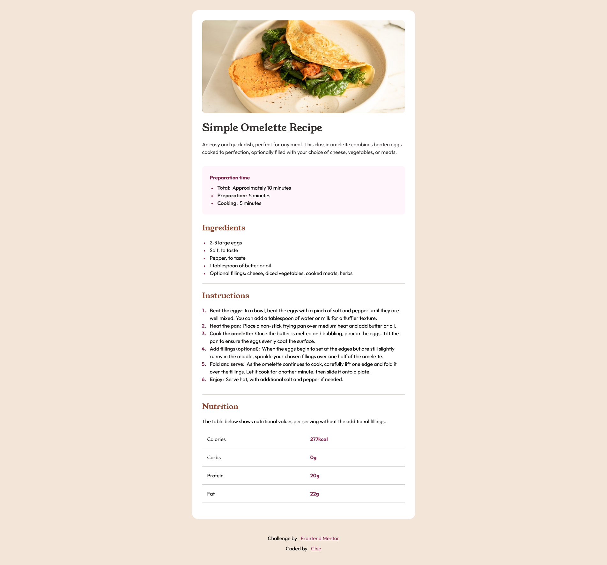

# Frontend Mentor - Recipe page solution

This is a solution to the [Recipe page challenge on Frontend Mentor](https://www.frontendmentor.io/challenges/recipe-page-KiTsR8QQKm). Frontend Mentor challenges help you improve your coding skills by building realistic projects. 

## Table of contents
- [Overview](#overview)
  - [The challenge](#the-challenge)
  - [Screenshot](#screenshot)
  - [Links](#links)
- [My process](#my-process)
  - [Built with](#built-with)
  - [What I learned](#what-i-learned)
  - [Continued development](#continued-development)
  - [Useful resources](#useful-resources)
- [Author](#author)

## Overview
## The challenge
-The challenge was to build a recipe page and make it look as close as the reference design in both desktop version and mobile version.

### Screenshot
- This is what I came up with.
---> desktop version 
---> mobile version 

### Links
- Solution URL: [FM-Recipe-page Repo](https://github.com/cos-0000/fm-recipe-page)
- Live Site URL: [FM-Recipe-page Site](https://cos-0000.github.io/fm-recipe-page/)

## My process
- First, I started by analyzing the structure of the page based on the images provided. Then, I built it according to the flow of the recipe page using semantic HTML. Next, I added the styles and placed it in css variables. After ensuring that all of the styles I need are included, I started developing the page. I initialized git to manage the version history and uploaded my local version to my remote repository on my github account. After I achieved what I am going for, I proceeded to fixing the mobile responsiveness of the page and then uploaded the recipe page on github pages.

### Built with
- Semantic HTML5 markup
- CSS custom properties
- Flexbox
- Mobile-first workflow

### What I learned
- how to manipulate ol and ul elements and how to use the ::marker pseudo code

### Continued development
-I still have a lot to explore in front-end development, but I am really interested in making web motion designs.

### Useful resources
- I just mostly used edge's Copilot since it seeks answers from the web so basically it's like a shortcut, it is also very insightful when answering some queries that I have. 

## Author
- Website - [cos-0000](https://github.com/cos-0000)
- Frontend Mentor - [cos-0000](https://www.frontendmentor.io/profile/cos-0000)

