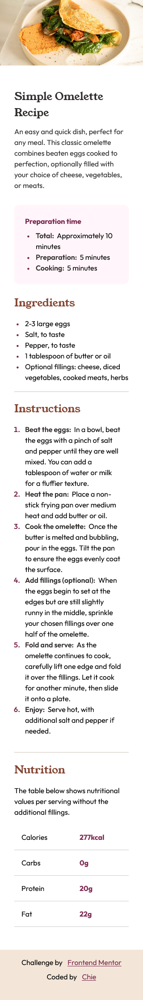

# Frontend Mentor - Recipe page solution

This is a solution to the [Recipe page challenge on Frontend Mentor](https://www.frontendmentor.io/challenges/recipe-page-KiTsR8QQKm). Frontend Mentor challenges help you improve your coding skills by building realistic projects. 

## Table of contents
- [Overview](#overview)
  - [The challenge](#the-challenge)
  - [Screenshot](#screenshot)
  - [Links](#links)
- [My process](#my-process)
  - [Built with](#built-with)
  - [What I learned](#what-i-learned)
  - [Continued development](#continued-development)
  - [Useful resources](#useful-resources)
- [Author](#author)


## Overview
## The challenge
-The challenge was to build a recipe page and make it look as close as the reference design in both desktop version and mobile version.

### Screenshot
- This is what I came up with.
---> desktop version 
---> mobile version 

### Links
- Solution URL: [Add solution URL here](https://your-solution-url.com)
- Live Site URL: [Add live site URL here](https://your-live-site-url.com)

## My process
- First, I started by analyzing the structure of the page based on the images provided. Then, I built it according to the flow of the recipe page using semantic HTML. Next, I added the styles and placed it in css variables. After ensuring that all of the styles I need are included, I started developing the page. I initialized git to manage the version history and uploaded my local version to my remote repository on my github account. I started styling the page from bottom to top, but I got stuck on the ol and ul elements since there are some modifications that I have to do to match the design. After I achieved what I am going for, I proceeded to fixing the mobile responsiveness of the page. After being statisfied with the outcome, I uploaded the recipe page on github pages.

### Built with
- Semantic HTML5 markup
- CSS custom properties
- Flexbox
- Mobile-first workflow

### What I learned
- I had a difficulty dealing with the modifications that I need to do for ol and ul elements, such as making the bullet smaller and changing its color, as well as the font-weight styling and space in between the number and the li element's text for the ol element. Luckily, the ::before pseudo element came in handy. I first used the ::marker pseudo element, but I cannot apply font-weight, margin, and padding properties to it due to its restrictions. I had to use edge's Copilot to seek for answers quickly since I also had additional questions. Through using it, I was also able to fully understand the fix. This was also my first time to use the counter-reset and counter-increment properties so this was a really fun experience.

Here are the code for the ul and ol modifications I did:

```css
ul li::before {
	content: "\2022";
	font-size: 1em;
	color: var(--clr-rose-800);
	margin-right: 1em;
	display: flex;
	align-items: center;
}

ol {
	counter-reset: item;
	padding: 1rem 0;
	list-style: none;
}
ol li {
	counter-increment: item;
	position: relative;
	padding: 0.5em 0 0 1.5em;
}
ol li::before {
	content: counter(item) ".";
	font-weight: var(--fw-body-700);
	color: var(--clr-rose-800);
	padding-right: 0.5em;
	position: absolute;
	left: 0;
}
```

### Continued development
-I still have a lot to explore in front-end development, but I am really interested in making web motion designs.

### Useful resources
- I just mostly used edge's Copilot since it seeks answers from the web so basically it's like a shortcut, it is also very insightful when answering some queries that I have. 


## Author
- Website - [cos-0000](https://github.com/cos-0000)
- Frontend Mentor - [cos-0000](https://www.frontendmentor.io/profile/cos-0000)

